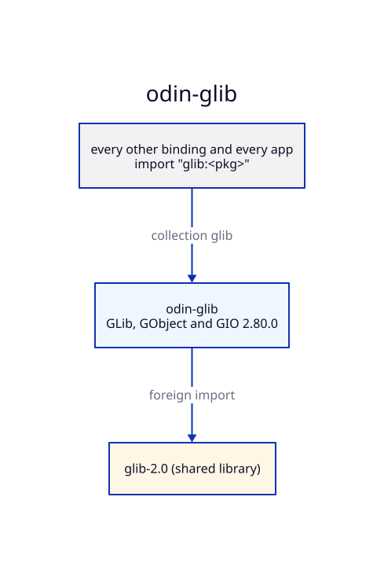

# Architecture — odin-glib

## Generation

`make generate` runs `scripts/generate.sh`: for each of `glib`, `gobject` and `gio`, runic
reads the package's `rune.yml`, then `scripts/postprocess.sh <pkg>` rewrites what runic gets
wrong, and finally `scripts/type-casts.sh` writes `gio/type_casts.odin`. The result is
reproducible byte for byte and committed.

The headers are /usr/include/glib-2.0 and /usr/lib/x86_64-linux-gnu/glib-2.0/include
(libglib2.0-dev). `scripts/generate.sh` links `build/sys` to `/`; the rune files name the
headers as `../build/sys/usr/include/…`, because runic matches its `extern` globs against
paths relative to the rune file (see [DECISIONS.md](DECISIONS.md)).

`stdinc/` holds stub headers (`time.h`, `pthread.h`, `stdarg.h`, `sys/types.h`) that stand in
for libc, whose types runic's libclang cannot find. The Odin side maps them to `core:c/libc`,
`core:sys/posix` and `core:sys/linux`.

## Layers

```
glib      ← gobject ← gio
```

`gobject` and `gio` take the declarations of the packages below them from the generated
`import glib "glib:glib"` lines (`extern.sources` in the rune files), so each C type is
declared once.

## Patches

Hand-written code that changes generated behaviour is listed in [PATCHED.md](PATCHED.md) and
pinned in `<pkg>/patched.odin` by a typed variable, so a regeneration that drops it fails to
compile. Hand-written files that add to the generated API (`gobject/helpers.odin`,
`gio/wrapper.odin`) are not touched by regeneration.

## Collections

The collection `glib` points at this repo's root. Packages import their siblings through it,
never by relative path.


